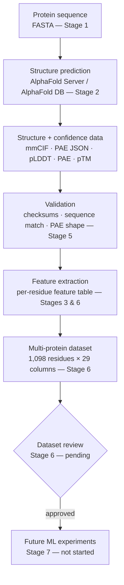
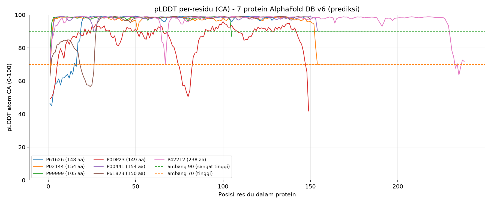
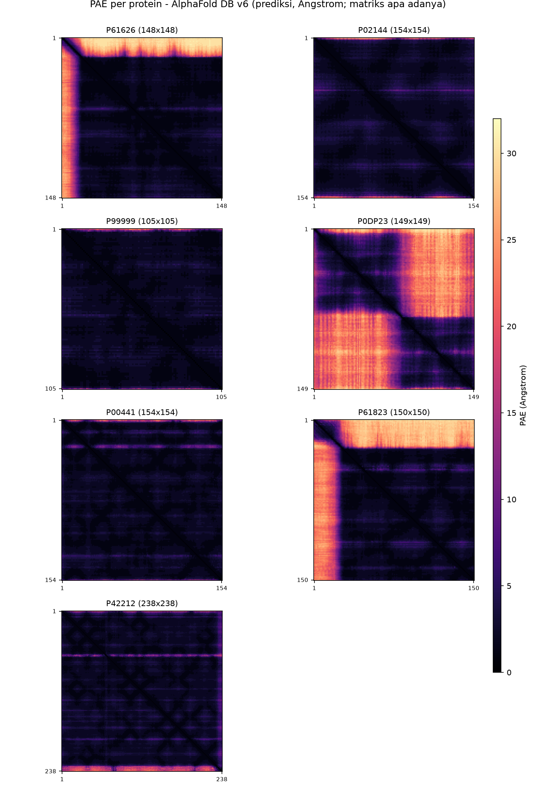

<div align="center">
  
</div>

<div align="center">
  <h1>AI + Biotech — Protein Analysis Pipeline</h1>
  <p>From AlphaFold structure predictions to a validated, reproducible residue-level dataset —<br/>
  a small, test-driven pipeline for computational structural biology and AI4Bio.</p>
</div>

<p align="center">
  
  
  
</p>

---

## About the Project

This is an **early-stage AI for Biotechnology (AI4Bio) research project** in computational
biology, currently focused on **protein structure analysis, residue-level feature extraction,
dataset construction, and validation**. It builds a **data pipeline** that starts from protein
sequences, uses AlphaFold predictions (AlphaFold Server for a single reference protein, and the
AlphaFold Database for a curated 7-protein set), and ends with a **validated, residue-level
feature dataset**: the foundation for future AI-assisted biological research. The stack is
deliberately small and inspectable — Python, Biopython, pandas, NumPy, matplotlib.

Every stage is gated by integrity tests that **recompute critical values from the raw prediction
files** instead of trusting derived outputs, and every output is documented — column definitions,
units, and exclusions included. The goal is a pipeline that is correct, reproducible, and honest
about what it does and does not show.

**Scope, stated plainly:** this is currently a *protein structure analysis and dataset engineering*
project. It is **not** a finished drug-discovery system: there is no molecular docking, no molecular
dynamics, no compound screening, and no wet-lab validation. **No ML model has been trained yet** —
Stage 7 (simple ML experiments) intentionally comes only after the dataset review and a defined
research question.

## Research Objectives

The project investigates how protein structural information can be transformed into **reliable,
machine-readable features** for future computational biology and AI research. The premise is
deliberately bottom-up: before any model is trained, the data itself — its provenance, column
definitions, units, and integrity — must be trustworthy.

**Established work.** Protein sequence and structure analysis of a reference protein,
residue-level feature extraction with fully documented definitions and units, controlled
construction of a 7-protein dataset from the AlphaFold Database, and integrity validation
(checksums, sequence matching, and recomputation of derived values from the raw prediction
files).

**Future goals.** Once the dataset review is complete and a measurable biological question is
defined, the project aims to establish baselines, expand the dataset beyond the current
validation set, design leakage-resistant evaluation (protein-level splits), and evaluate
appropriate AI methods. No biological hypothesis, label, or trained model exists yet —
intentionally, so that the question is defined before the modeling. See
[Limitations and Future Work](#limitations-and-future-work).

## Research FAQ

**What is this project about?**
An early-stage AI4Bio / computational biology research project. It builds and validates a data
pipeline that turns protein sequences into AlphaFold-predicted structures and then into a
machine-readable, residue-level feature dataset (currently 7 proteins, 1,098 residues × 29
columns) — engineering groundwork for future AI-assisted biological research.

**What scientific problem does it aim to address?**
How protein structural information — including the confidence measures that come with predicted
structures (pLDDT, PAE) — can be turned into reliable, well-documented, machine-readable
features suitable for AI research. The current work addresses *data quality and reproducibility*;
a specific biological hypothesis is not yet part of the project.

**What has been completed so far?**
Stages 1–6: sequence analysis, structure analysis (ubiquitin reference), residue-level feature
extraction (ubiquitin, 76 × 28), dataset planning (7 proteins, 6 functional categories), the
controlled AlphaFold DB download and validation (14 v6 files, checksums and sequences verified),
and the multi-protein dataset (1,098 residues × 29 columns). All four test suites pass — 72/72
checks in total (20 + 12 + 16 + 24). Stage 6 is complete but still awaiting review; no machine
learning has been done.

**Is this already an AI model for drug discovery?**
No. There is no trained model, no molecular docking, no molecular dynamics, no compound
screening, and no wet-lab validation. AlphaFold itself is a deep-learning system, and its
predictions are the data this project works with — but the project's own outputs are validated
datasets and analysis, not drug-discovery results.

**Why might HPC or powerful GPUs be useful?**
Not for the current pipeline — it is small and runs on a standard machine without a GPU. HPC or
GPU resources could become relevant only if the project later moves to larger-scale protein
representation learning or model training and evaluation. Whether such hardware is warranted
depends on dataset size, model architecture, memory requirements, and experimental design — more
compute does not by itself produce better science. See
[Computing Resources and Research Support](#computing-resources-and-research-support).

**What are the next research goals?**
Complete the pending Stage 6 review; define a measurable biological question and a label from
official annotations (e.g., UniProt GO terms or EC numbers — not yet decided); expand the
dataset; establish baselines; and design leakage-resistant evaluation (protein-level splits)
before selecting and training appropriate AI methods.

**Is the project open to academic collaboration?**
Yes. The pipeline, dataset, schema, and test suites are public and reproducible, and the project
welcomes academic collaboration, mentorship, and discussions about research direction or
computing support. Reach out through the repository's GitHub page (e.g., by opening an issue).

## Research Pipeline



Each arrow is a checkpoint, not just a hand-off: the structure data is validated against
checksums and UniProt sequences before extraction, extraction follows a documented schema, and
the resulting dataset has its own test suite. Full stage logs live in
[`docs/`](docs/) (written in Indonesian, the project's working language).

## Current Results

Pipeline status across all stages — as of the latest verified runs:

| Stage | Output | Verification |
|---|---|---|
| 1 | Sequence analysis — ubiquitin, 76 aa | reference input for Stages 2–3 |
| 2 | Structure analysis — ubiquitin (AlphaFold Server), pLDDT / pTM | analysis artifacts in `results/` |
| 3 | Residue-level features — 76 residues × 28 columns | **20/20 tests PASS** |
| 4 | Dataset manifest — 7 candidate proteins, 6 functional categories | **12/12 tests PASS** |
| 5 | Controlled download + validation — 14 files (7 CIF + 7 PAE JSON, AFDB v6) | **16/16 tests PASS** |
| 6 | Multi-protein dataset — 1,098 residues × 29 columns | **24/24 tests PASS** — review pending |
| 7 | Machine-learning experiments | not started — awaiting Stage 6 review |

**The multi-protein dataset** (`results/dataset/multi_protein_residue_features.csv`) contains
**1,098 residue rows × 29 columns**: 3 protein identifier columns (`protein_id`,
`uniprot_accession`, `afdb_id`) and 26 numeric/structural feature columns — one row per residue,
built from the frozen AlphaFold DB dataset.

| Accession | Protein | Organism | Residues | Mean pLDDT | Mean PAE (Å) |
|---|---|---|---|---|---|
| P61626 | Lysozyme C | *Homo sapiens* | 148 | 94.07 | 5.96 |
| P02144 | Myoglobin | *Homo sapiens* | 154 | 97.18 | 2.67 |
| P99999 | Cytochrome c | *Homo sapiens* | 105 | 97.93 | 2.06 |
| P0DP23 | Calmodulin-1 | *Homo sapiens* | 149 | 85.24 | 13.28 |
| P00441 | Superoxide dismutase [Cu-Zn] | *Homo sapiens* | 154 | 97.93 | 2.18 |
| P61823 | Ribonuclease pancreatic | *Bos taurus* | 150 | 94.04 | 8.16 |
| P42212 | Green fluorescent protein | *Aequorea victoria* | 238 | 96.64 | 2.90 |

All 7 proteins passed per-protein validation. Summary values above are taken from
`results/dataset/multi_protein_summary.csv`; column definitions, units, and derivation rules are
in [`multi_protein_structure_features.json`](results/dataset/multi_protein_structure_features.json).

**Verification suites** (all measured on freshly generated outputs; each script exits `0` only if
every check passes):

| Suite | Scope | Result |
|---|---|---|
| `src/test_protein_features.py` | Stage 3 — ubiquitin table vs. raw predictions | 20/20 PASS |
| `src/test_dataset_manifest.py` | Stage 4 — manifest structure & completeness | 12/12 PASS |
| `src/test_afdb_download.py` | Stage 5 — file integrity, checksums, metadata | 16/16 PASS |
| `src/test_multi_protein_features.py` | Stage 6 — recomputation from raw files; reproducibility | 24/24 PASS |

**Current status:** Stage 6 is complete but **awaiting review**; no trained ML model exists yet,
and no biological conclusions are drawn from these predictions.

## Dataset Visualizations

Generated by `src/extract_multi_protein_features.py`, from the frozen AlphaFold DB dataset:

<div align="center">
  
  <br/>
  <em>pLDDT per residue (CA atom) for all 7 proteins — dashed reference bands at 90 and 70.</em>
</div>

<div align="center">
  
  <br/>
  <em>PAE matrices, one per protein (Å) — darker regions indicate lower predicted alignment error.</em>
</div>

*Chart labels follow the project's working language (Indonesian).*

## Repository Structure

```
ai-biotech/
├── data/
│   ├── ubiquitin_sequence.fasta             # Stage 1 input — ubiquitin, 76 aa
│   ├── alphafold_db/
│   │   ├── raw/                             # frozen dataset: 7 CIF models + 7 PAE JSON (v6)
│   │   └── metadata/                        # candidate list, API snapshots, checksums, download log
│   └── alphafold_downloads/                 # AlphaFold Server example outputs (local only, git-ignored)
├── structures/
│   └── ubiquitin_alphafold.cif              # Stage 2–3 reference structure
├── src/
│   ├── analyze_protein.py                   # Stage 1–2: sequence + structure analysis
│   ├── extract_protein_features.py          # Stage 3: residue-level extraction (ubiquitin)
│   ├── prepare_dataset.py                   # Stage 4: dataset manifest (7 candidate proteins)
│   ├── download_afdb_dataset.py             # Stage 5: controlled AlphaFold DB download
│   ├── validate_afdb_dataset.py             # Stage 5: offline integrity validation
│   ├── extract_multi_protein_features.py    # Stage 6: multi-protein feature extraction
│   └── test_*.py                            # integrity test suites (Stages 3–6)
├── results/
│   ├── dataset/                             # Stage 4–6 outputs (CSV · JSON · PNG)
│   └── ...                                  # Stage 1–3 outputs (JSON · CSV · PNG)
├── docs/
│   ├── DATASET_PLAN.md                      # dataset source plan & candidate selection
│   ├── PROJECT_STATUS.md                    # single source of truth for project status
│   ├── TAHAP_5_AFDB_DOWNLOAD_REPORT.md      # Stage 5 download & integrity report
│   ├── TAHAP_6_MULTI_PROTEIN_FEATURE_REPORT.md  # Stage 6 extraction report & schema
│   └── assets/banner.svg                    # README hero banner
├── notebooks/
│   └── 01_first_protein_analysis.ipynb      # concept notebook (amino acids → pLDDT/PAE/pTM)
├── requirements.txt
└── README.md
```

> `data/alphafold_downloads/` holds the AlphaFold Server example outputs used in Stages 2–3.
> It is kept local (see `.gitignore`) because the public AlphaFold DB files are the tracked
> dataset; the downloadable entry point for the dataset is `src/download_afdb_dataset.py`.

## Getting Started

**Prerequisites:** Python **3.12.10**, `git`, and network access only for the optional download
step (the dataset is already committed).

**Setup** — create the virtual environment and install dependencies:

```bash
python -m venv .venv

# Windows
.venv\Scripts\activate
# macOS / Linux
source .venv/bin/activate

pip install -r requirements.txt
```

**Sequence & structure analysis** (works directly from a fresh clone):

```bash
python src/analyze_protein.py --fasta data/ubiquitin_sequence.fasta   # sequence only
python src/analyze_protein.py                                         # scan structures/ folder
python src/analyze_protein.py structures/ubiquitin_alphafold.cif      # one structure file
python src/analyze_protein.py --help                                  # all options
```

**Dataset pipeline** (Stages 4–6; works from a fresh clone — the raw AFDB files are committed):

```bash
# Stage 4 — build the dataset manifest (no downloads)
python src/prepare_dataset.py
python src/test_dataset_manifest.py

# Stage 5 — controlled download (already run) + offline validation & integrity tests
python src/download_afdb_dataset.py
python src/validate_afdb_dataset.py
python src/test_afdb_download.py

# Stage 6 — multi-protein feature extraction & tests
python src/extract_multi_protein_features.py
python src/test_multi_protein_features.py
```

**Stage 3 (ubiquitin)** additionally requires the AlphaFold Server example outputs in
`data/alphafold_downloads/` — not committed to the repository:

```bash
python src/extract_protein_features.py
python src/test_protein_features.py
```

All test scripts **exit `0` only when every check passes**, and all outputs are written to
`results/` (dataset stage outputs go to `results/dataset/`).

## Scientific Notes

**pLDDT (per-residue confidence, 0–100).** The model's estimated confidence in the **local**
structure around each residue. As a rough guide: above 90 very high, 70–90 confident, 50–70 low,
below 50 very low. It should be read per region — a single global average hides disordered or
uncertain segments, which is exactly why the dataset stores per-residue values.

**PAE (Predicted Alignment Error, Å).** An N×N matrix estimating the expected position error of
residue *i* if the structure is aligned on residue *j*. Low PAE between two residues means the
model is confident about their **relative placement** — useful for judging domain packing. The
dataset also summarizes PAE per residue with explicit aggregation rules (`pae_mean_row`,
`pae_mean_col`, `pae_local_mean_k10`), documented in the schema JSON.

**Two data sources, intentionally separated.** The *ubiquitin example* (AlphaFold Server,
Stages 2–3) is a single reference protein used to learn and validate the pipeline; its full
outputs include a `contact_probs` matrix. It is a learning artifact, and it is **not** used as
ML training data. The *multi-protein dataset* (AlphaFold DB, Stages 4–6) consists of 7
single-chain v6 models downloaded through the official API, checksummed, and frozen before any
extraction.

**Why two columns are missing from the multi-protein table.** Stage 3's 28-column schema includes
`contact_prob_sum` and `n_high_conf_contacts`, which depend on the `contact_probs` matrix. That
matrix is not part of the public AlphaFold DB downloads (which provide CIF + PAE JSON only), so
both columns are **excluded** — not imputed, approximated, or silently redefined — and the
exclusion is documented explicitly in
[`multi_protein_structure_features.json`](results/dataset/multi_protein_structure_features.json).
The remaining 26 features are unchanged from the Stage 3 definitions.

**Predictions are not experimental validation.** pLDDT, PAE, and pTM measure the model's internal
confidence — not biological truth. A high-confidence prediction can still be wrong, and verifying
a structure requires real experiments (X-ray crystallography, NMR, cryo-EM, and so on). Nothing
in this repository should be read as experimentally validated structure or function.

## Limitations and Future Work

### Completed (Stages 1–6)

Protein data retrieval (AlphaFold Server reference structure; 7 curated AlphaFold DB entries),
structure validation (checksums, sequence matching, PAE shape), residue-level feature extraction
(ubiquitin 76 × 28; multi-protein 1,098 × 29), dataset construction, and the integrity test
suites (72 checks across Stages 3–6, all passing). Details and evidence in
[Current Results](#current-results).

### Not yet completed

None of the following exist yet, and none are claimed:

- **Trained predictive models.** No training, no train/test split, no evaluation metrics —
  Stage 7 has not started.
- **Molecular docking, molecular dynamics, compound screening.** No such analysis exists in this
  project.
- **Experimental validation.** No wet-lab work, and the predictions have not been compared
  against experimental (e.g., PDB) structures.

### Current limitations

- **Small, narrow dataset.** 7 single-chain proteins (1,098 residues; 5 human + 2 non-human) are
  a pipeline-validation set — not a basis for biological generalization. Residues within one
  protein are strongly correlated, so 1,098 rows are not 1,098 independent samples.
- **Prediction-only ground truth.** The dataset stores AlphaFold predictions with no attached
  experimental reference structures.
- **Single-chain only.** No complexes, no ligands, no post-translational modifications.

### Future direction

1. **Complete the Stage 6 review** — dataset schema, per-protein statistics, documented
   exclusions (still pending).
2. **Verify feature consistency** — confirm that feature definitions and units match across the
   Stage 3 and Stage 6 tables.
3. **Define a measurable biological research question** — a target and hypothesis this data can
   actually support, with labels drawn from official annotations (e.g., UniProt GO terms or EC
   numbers; not yet decided).
4. **Expand the dataset** beyond the current 7-protein validation set.
5. **Design leakage-resistant evaluation** — for example, splitting at the protein level rather
   than the residue level.
6. **Establish baselines and select appropriate AI methods** — only once the question, labels,
   and splits are fixed, with limitations reported honestly.

## Computing Resources and Research Support

All work in this repository has been conducted at a limited scale: 7 proteins, 1,098 residue
rows, and about 1.5 MB of prediction files, processed end-to-end on a standard machine with plain
Python libraries (Biopython, pandas, NumPy, matplotlib). **No GPU or HPC resource is required to
run or reproduce the current pipeline** — a laptop suffices.

Future stages may differ. If the project moves toward larger-scale protein representation
learning, model training and evaluation, or other computationally demanding experiments —
depending on the final scientific question — then GPU or HPC access could become relevant. Which
hardware is appropriate is a function of dataset size, model architecture, memory requirements,
and experimental design; access to powerful hardware does not by itself produce better scientific
results.

If the research direction warrants it, the project would benefit from:

- **HPC infrastructure and GPU access** — for future large-scale experiments, once a concrete
  experimental design justifies them.
- **Academic mentorship** — guidance on framing a tractable biological question and rigorous,
  leakage-resistant evaluation.
- **Research collaboration** — partners in computational biology and machine learning for
  methodological feedback and joint work.

**Status:** no HPC application has been submitted, and no institution has agreed to provide
computing resources. This section is an expression of interest in future collaboration — not a
claim of existing support.

## Documentation & Acknowledgments

| Document | Contents |
|---|---|
| [`docs/PROJECT_STATUS.md`](docs/PROJECT_STATUS.md) | Single source of truth for project status |
| [`docs/DATASET_PLAN.md`](docs/DATASET_PLAN.md) | Dataset source plan and candidate selection |
| [`docs/TAHAP_5_AFDB_DOWNLOAD_REPORT.md`](docs/TAHAP_5_AFDB_DOWNLOAD_REPORT.md) | Stage 5 download and integrity report |
| [`docs/TAHAP_6_MULTI_PROTEIN_FEATURE_REPORT.md`](docs/TAHAP_6_MULTI_PROTEIN_FEATURE_REPORT.md) | Stage 6 extraction report and schema |
| [`results/dataset/multi_protein_structure_features.json`](results/dataset/multi_protein_structure_features.json) | Machine-readable schema: column definitions, units, exclusions |
| [`notebooks/01_first_protein_analysis.ipynb`](notebooks/01_first_protein_analysis.ipynb) | Concept notebook: amino acids, sequences, structures, pLDDT / PAE / pTM |

*Stage reports are written in Indonesian (the project's working language); this README is the
English entry point.*

**Data source.** All structure predictions come from the
[AlphaFold Protein Structure Database](https://alphafold.ebi.ac.uk/) (v6 models), developed by
EMBL-EBI and Google DeepMind. AFDB data is released under
[CC BY 4.0](https://creativecommons.org/licenses/by/4.0/), with attribution to EMBL-EBI, Google
DeepMind, and UniProt. The repository's own code does not declare a license yet.

**Citations.**

- Jumper, J. *et al.* "Highly accurate protein structure prediction with AlphaFold."
  *Nature* 596, 583–589 (2021). [doi:10.1038/s41586-021-03819-2](https://doi.org/10.1038/s41586-021-03819-2)
- Varadi, M. *et al.* "AlphaFold Protein Structure Database: massively expanding the structural
  coverage of protein-sequence space with high-accuracy models." *Nucleic Acids Research* 50,
  D439–D444 (2022). [doi:10.1093/nar/gkab1061](https://doi.org/10.1093/nar/gkab1061)

**Built with** [Biopython](https://biopython.org/), [pandas](https://pandas.pydata.org/),
[NumPy](https://numpy.org/), and [matplotlib](https://matplotlib.org/). Test suites are
plain-Python self-checks — there is no CI pipeline and no release process yet.

---

<p align="center"><em>AlphaFold outputs are model predictions — not experimental validation.</em></p>
